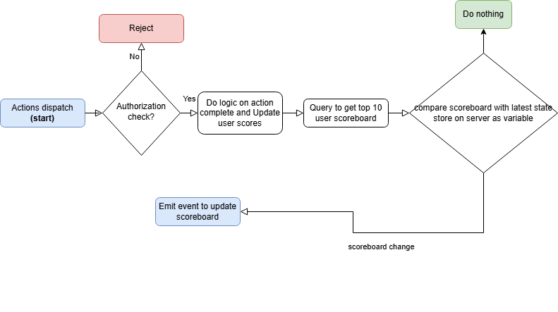
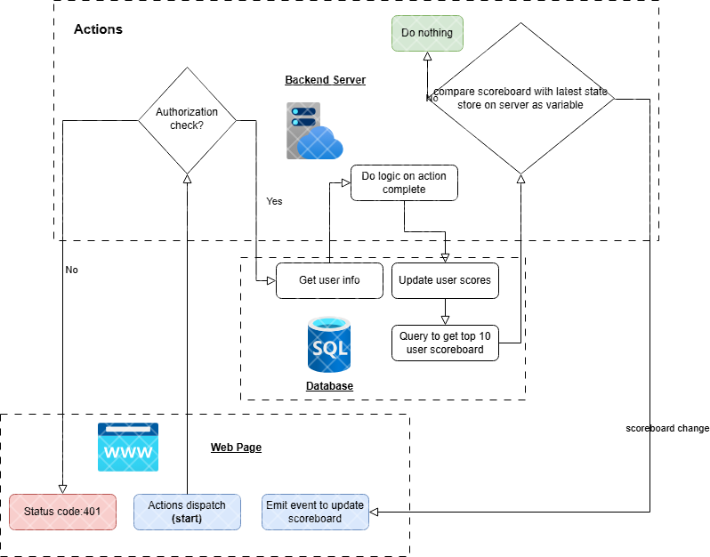
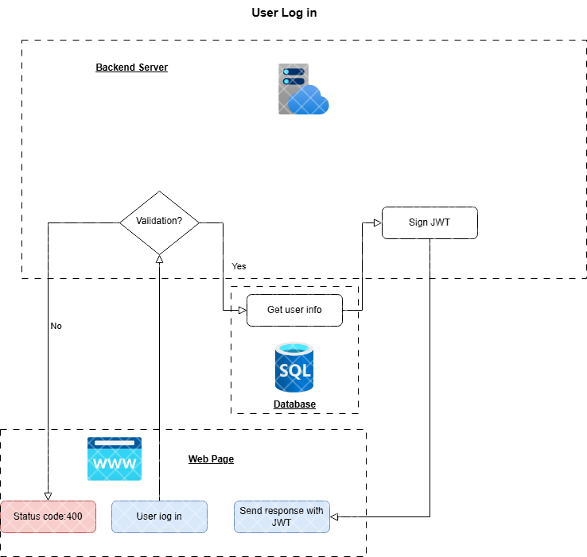

## Features
1. **Leaderboard Display**: Displays the top 10 user scores.
- Front-End implement page to show scoreboard use the `GET /scores` api to get scoreboard when load page.
- Front-End implement web socket connection to receive event from back-end to update scoreboard component without reload/refresh page.
- Back-end implement web socket with socket.io: https://www.npmjs.com/package/socket.io
use io.emit('broadcast', /* … */); to emit event to all connected socket payload will be updated scoreboard when it change state.

2. **User Actions**:
-Front-End implement dispatch API call to `POST /users/actions/complete` using Bearer JWT, which is store in localstorage or cookies of client/user browser when logged in.
-Back-End implement Authorization when user login, provide JWT with userinfo and expireTime signed with `secret` as response using https://www.npmjs.com/package/@types/jsonwebtoken
-Back-End implement API endpoints to receive, implement JWT validation as authentication middleware before process to prevent malicious action.

3. **Scoreboard update Logic on Backend side**:
-Backend implement and optimize query to database get the top 10 user scores with the most effeciency.

-Use node-cache or just store latest state of scoreboard as variables,
-Backend implement action complete logic and also invoke top 10 user scores query on `POST /users/actions/complete`, compare query result to the latest state of scoreboard if state changed, use io.emit('broadcast', /* … */); to emit event, else do nothing.

-Optional: If we plan to scale out our server we will need a shared cache to store latest state of scoreboard instead of variables => we could use redis cache.

-Alternative approach: skip comparison step (compare query result to the latest state of scoreboard), emit updated scoreboard everytime `POST /users/actions/complete` dispatch.
---

## API Endpoints

### `GET /scores`
- **Description**: Retrieves the top 10 scores for display on the leaderboard.
- **Response**: Returns a list of the top 10 user scores, sorted in descending order.

### `POST /users/actions/complete`
- **Description**: Updates a user's score based on their completed actions.
- **Authentication**: Bearer Token
- **Request Body**:
  ```json
  {
    "actions" : {
        "foo":"bar"
    }
  }

### Diagram
Flow:

LLD:


